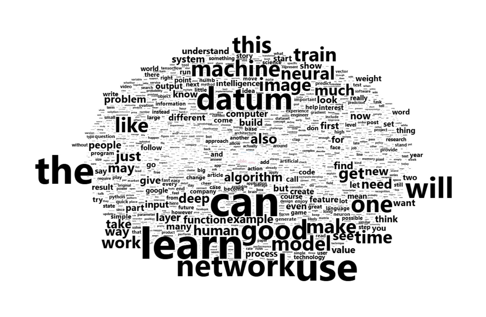
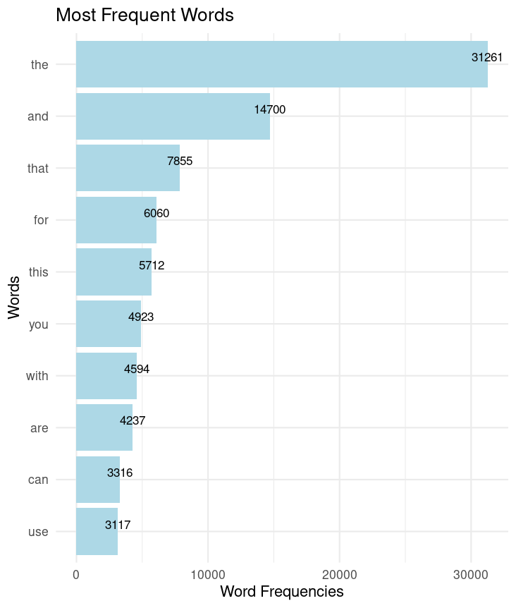

<html>
<head></head>
<body>
<h3>Articles Wordcloud</h3>

The current analysis is about the IBM HR analytics of the employees

 The analysis has been done using the following tools: 
    1.<a href="https://cran.r-project.org/web/packages/wordcloud2/vignettes/wordcloud.html">Wordcloud2.</a> 
    2.<a href="https://dplyr.tidyverse.org/articles/dplyr.html">dplyr.</a> 
    3.<a href="https://ggplot2.tidyverse.org">ggplot2.</a> 
    4.<a href="https://cran.r-project.org/web/packages/tm/index.html">tm.</a> 
    

 The outputs of the analysis are as follows:  
<strong>Wordcloud</strong> 
</img>  

<strong>Most frequently used words: </strong> 
</img>  

</body>
</html>